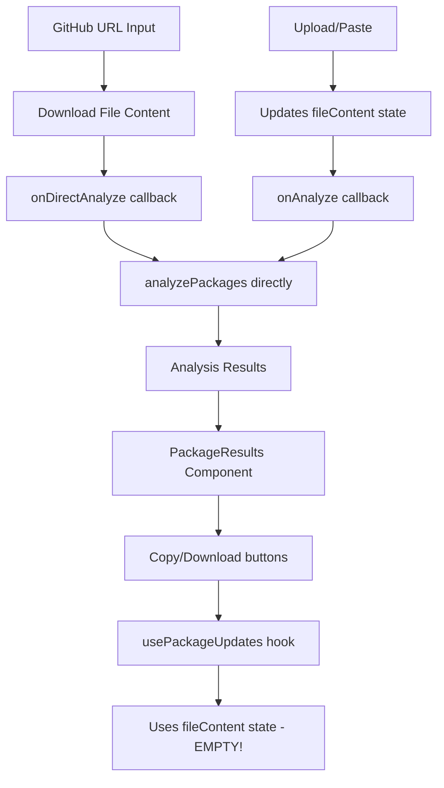
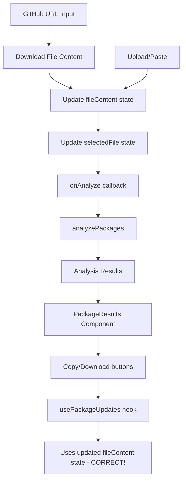

# Design Document

## Overview

Esta funcionalidade corrige um bug crítico no fluxo de análise via GitHub URL onde os botões "Copy" e "Download" não funcionam corretamente. O problema raiz é que o componente `PackageResults` (que contém a funcionalidade de copy/download) depende do estado `fileContent` e `selectedFile?.name` da página principal, mas quando a análise é feita via GitHub URL, esses estados não são atualizados com o conteúdo baixado do GitHub.

A solução envolve modificar o fluxo de dados para garantir que o estado da aplicação seja consistentemente atualizado independente do método de entrada utilizado (Upload, Paste, ou GitHub URL).

## Architecture

### Current Architecture Problem



### Proposed Architecture Solution



### Integration Points

1. **FileUploadSection Component**: Modificar para atualizar estado quando GitHub URL é usado
2. **Main Page Component**: Ajustar callbacks para manter consistência de estado
3. **GitHubUrlInput Component**: Modificar para usar callback unificado
4. **State Management**: Garantir que fileContent e selectedFile sejam sempre atualizados

## Components and Interfaces

### 1. Modified FileUploadSection Component

**Location**: `src/components/package-checker/FileUploadSection.tsx`

**Changes Required**:
- Modificar o callback `onDirectAnalyze` para atualizar o estado antes de chamar análise
- Garantir que o nome do arquivo seja preservado corretamente

**New Interface**:
```typescript
interface FileUploadSectionProps {
  // ... existing props
  onDirectAnalyze: (content: string, fileName: string) => void; // Modified behavior
}
```

### 2. Modified Main Page Component

**Location**: `src/app/page.tsx`

**Changes Required**:
- Modificar `onDirectAnalyze` callback para atualizar `fileContent` e `selectedFile` states
- Garantir limpeza correta de estado entre diferentes métodos

**New Implementation**:
```typescript
const handleDirectAnalyze = (content: string, fileName: string) => {
  // Update state first
  setFileContent(content);
  setSelectedFile(createFileFromContent(content, fileName));
  
  // Then analyze
  analyzePackages(content, fileName);
};
```

### 3. Helper Functions

**Location**: `src/utils/file-utils.ts` (new file)

**Purpose**: Criar funções utilitárias para manipulação de arquivos

```typescript
interface FileUtils {
  createFileFromContent: (content: string, fileName: string) => File;
  getFileTypeFromName: (fileName: string) => string;
  validateFileName: (fileName: string) => boolean;
}
```

## Data Models

### File State Management

```typescript
interface FileState {
  content: string;
  fileName: string;
  source: 'upload' | 'paste' | 'github';
  originalFile?: File;
}

interface GitHubFileData {
  content: string;
  fileName: string;
  fileType: 'package.json' | 'requirements.txt' | 'pubspec.yaml';
  repoInfo: {
    owner: string;
    repo: string;
    url: string;
  };
}
```

### State Update Flow

```typescript
interface StateUpdateFlow {
  // When GitHub URL analysis completes
  updateFromGitHub: (content: string, file: DependencyFile, repoData: GitHubRepoData) => void;
  
  // When file upload occurs
  updateFromUpload: (file: File, content: string) => void;
  
  // When paste occurs
  updateFromPaste: (content: string) => void;
  
  // Clear state between analyses
  clearState: () => void;
}
```

## Error Handling

### Error Categories

1. **State Synchronization Errors**
   - File content and metadata mismatch
   - State not updated before analysis
   - Inconsistent state between components

2. **File Creation Errors**
   - Invalid file content for File object creation
   - Missing or invalid file names
   - Unsupported file types

3. **Copy/Download Errors**
   - Empty content when generating updates
   - Incorrect file names or extensions
   - MIME type detection failures

### Error Handling Strategy

```typescript
interface ErrorHandling {
  // Validate state before copy/download operations
  validateStateConsistency: () => boolean;
  
  // Handle file creation errors
  handleFileCreationError: (error: Error, content: string, fileName: string) => void;
  
  // Provide fallback for missing file information
  getFallbackFileInfo: (content: string) => { name: string; type: string };
}
```

### Specific Error Recovery

- **Missing File Name**: Use detected file type as fallback name
- **Empty Content**: Show clear error message and prevent copy/download
- **Invalid File Type**: Default to text/plain and generic extension
- **State Mismatch**: Force state refresh and show warning to user

## Testing Strategy

### Unit Tests

1. **State Management Tests**
   - Test fileContent state updates for all input methods
   - Test selectedFile state updates for GitHub URL flow
   - Test state clearing between different analyses

2. **File Creation Tests**
   - Test File object creation from GitHub content
   - Test file name preservation and validation
   - Test MIME type detection for different file types

3. **Copy/Download Integration Tests**
   - Test copy functionality with GitHub URL content
   - Test download functionality with correct file names
   - Test content generation with updated packages

### Integration Tests

1. **End-to-End Flow Tests**
   - Complete GitHub URL → Analysis → Copy flow
   - Complete GitHub URL → Analysis → Download flow
   - State consistency across different input methods

2. **Cross-Method Consistency Tests**
   - Compare copy/download behavior between Upload, Paste, and GitHub URL
   - Test switching between different input methods
   - Test state cleanup and isolation

### Test Scenarios

```typescript
const TEST_SCENARIOS = {
  GITHUB_TO_COPY: {
    description: 'GitHub URL analysis followed by copy operation',
    steps: [
      'Enter GitHub URL',
      'Select dependency file',
      'Complete analysis',
      'Click copy button',
      'Verify copied content matches updated packages'
    ]
  },
  
  GITHUB_TO_DOWNLOAD: {
    description: 'GitHub URL analysis followed by download operation',
    steps: [
      'Enter GitHub URL',
      'Select dependency file', 
      'Complete analysis',
      'Click download button',
      'Verify downloaded file has correct name and content'
    ]
  },
  
  METHOD_SWITCHING: {
    description: 'Switch between different input methods',
    steps: [
      'Use GitHub URL analysis',
      'Switch to Paste method',
      'Verify state is cleared',
      'Complete paste analysis',
      'Verify copy/download work correctly'
    ]
  }
};
```

### Performance Considerations

1. **State Update Efficiency**
   - Minimize unnecessary re-renders when updating state
   - Batch state updates when possible
   - Use React.memo for components that don't need frequent updates

2. **File Object Creation**
   - Create File objects only when necessary
   - Cache file objects to avoid recreation
   - Use lightweight file metadata when full File object not needed

3. **Memory Management**
   - Clear large file contents when switching methods
   - Avoid keeping multiple copies of file content in memory
   - Implement proper cleanup in useEffect hooks

### Security Considerations

1. **Content Validation**
   - Validate file content before creating File objects
   - Sanitize file names to prevent path traversal
   - Limit file content size to prevent memory issues

2. **State Isolation**
   - Ensure state from different analyses doesn't leak
   - Clear sensitive data when switching methods
   - Validate state consistency before operations

3. **File Download Security**
   - Validate generated file content before download
   - Use safe file names for downloads
   - Prevent XSS through file content injection

## Implementation Plan

### Phase 1: Core State Management Fix
1. Modify `onDirectAnalyze` callback in main page component
2. Update `FileUploadSection` to handle GitHub URL state updates
3. Create utility functions for File object creation

### Phase 2: Integration and Testing
1. Test copy/download functionality with GitHub URL flow
2. Verify state consistency across all input methods
3. Add error handling for edge cases

### Phase 3: Polish and Optimization
1. Optimize state update performance
2. Add comprehensive error messages
3. Implement proper cleanup and memory management

### Rollback Strategy

If issues arise during implementation:
1. **Immediate Rollback**: Revert to using separate callback for GitHub URL
2. **Partial Rollback**: Keep state updates but add fallback logic
3. **Gradual Fix**: Implement fixes incrementally with feature flags

The design ensures backward compatibility while fixing the core issue of state synchronization between different input methods.