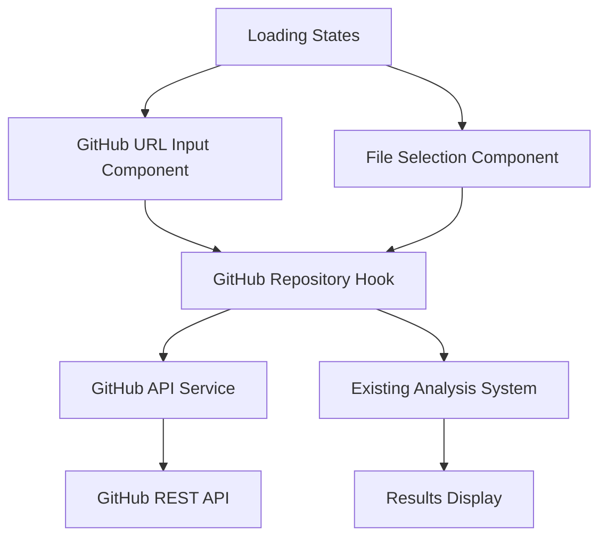

# Design Document

## Overview

Esta funcionalidade adiciona uma terceira opção de entrada para análise de dependências no Pack-Man, permitindo que usuários insiram URLs de repositórios públicos do GitHub. O sistema irá automaticamente detectar, baixar e analisar arquivos de dependências (package.json, requirements.txt, pubspec.yaml) diretamente do repositório.

A implementação se integra perfeitamente com a arquitetura existente do Pack-Man, seguindo os mesmos padrões de componentes, hooks e serviços já estabelecidos. A nova funcionalidade reutiliza todo o sistema de análise existente, apenas adicionando uma nova fonte de dados.

## Architecture

### High-Level Architecture



### Integration with Existing System

A nova funcionalidade se integra com os componentes existentes:

- **UI Layer**: Novo componente `GitHubUrlInput` se integra com o sistema de tabs existente
- **Hook Layer**: Novo hook `useGitHubRepository` segue o padrão dos hooks existentes
- **Service Layer**: Novo serviço `githubService` complementa os serviços existentes
- **Analysis Layer**: Reutiliza completamente o sistema de análise existente

### Data Flow

1. **Input Phase**: Usuário insere URL → Validação → Extração de owner/repo
2. **Discovery Phase**: Busca por arquivos de dependências via GitHub API
3. **Selection Phase**: Se múltiplos arquivos, usuário seleciona qual analisar
4. **Download Phase**: Download do conteúdo do arquivo selecionado
5. **Analysis Phase**: Processamento pelo sistema existente
6. **Display Phase**: Exibição dos resultados na interface existente

## Components and Interfaces

### 1. GitHubUrlInput Component

**Location**: `src/components/package-checker/GitHubUrlInput.tsx`

**Purpose**: Interface para inserção e validação de URLs do GitHub

**Props**:
```typescript
interface GitHubUrlInputProps {
  onAnalyze: (repoData: GitHubRepoData) => void;
  isLoading: boolean;
  error?: string;
}
```

**Features**:
- Input field com validação em tempo real
- Botão de análise com estado de loading
- Exibição de erros de validação
- Suporte a diferentes formatos de URL do GitHub

### 2. FileSelectionModal Component

**Location**: `src/components/package-checker/FileSelectionModal.tsx`

**Purpose**: Modal para seleção de arquivo quando múltiplos são encontrados

**Props**:
```typescript
interface FileSelectionModalProps {
  files: DependencyFile[];
  isOpen: boolean;
  onSelect: (file: DependencyFile) => void;
  onClose: () => void;
}
```

### 3. useGitHubRepository Hook

**Location**: `src/hooks/use-github-repository.ts`

**Purpose**: Gerenciar estado e lógica de busca de repositórios GitHub

**Interface**:
```typescript
interface UseGitHubRepositoryReturn {
  searchRepository: (url: string) => Promise<void>;
  downloadFile: (file: DependencyFile) => Promise<string>;
  isLoading: boolean;
  error: string | null;
  availableFiles: DependencyFile[];
  selectedFile: DependencyFile | null;
  reset: () => void;
}
```

### 4. GitHub API Service

**Location**: `src/lib/github-service.ts`

**Purpose**: Interação com a GitHub REST API

**Methods**:
```typescript
interface GitHubService {
  getRepositoryContent(owner: string, repo: string, path: string): Promise<GitHubContent>;
  searchDependencyFiles(owner: string, repo: string): Promise<DependencyFile[]>;
  validateRepository(owner: string, repo: string): Promise<boolean>;
}
```

## Data Models

### GitHub Repository Data

```typescript
interface GitHubRepoData {
  owner: string;
  repo: string;
  url: string;
  branch?: string;
}

interface DependencyFile {
  name: string;
  path: string;
  type: 'package.json' | 'requirements.txt' | 'pubspec.yaml';
  downloadUrl: string;
  size: number;
}

interface GitHubContent {
  name: string;
  path: string;
  content: string; // base64 encoded
  encoding: string;
  size: number;
  type: 'file' | 'dir';
}
```

### API Response Types

```typescript
interface GitHubApiResponse {
  name: string;
  path: string;
  sha: string;
  size: number;
  url: string;
  html_url: string;
  git_url: string;
  download_url: string;
  type: 'file' | 'dir';
  content?: string;
  encoding?: string;
}

interface GitHubError {
  message: string;
  status: number;
  documentation_url?: string;
}
```

### Hook State Types

```typescript
interface GitHubRepositoryState {
  isLoading: boolean;
  error: string | null;
  availableFiles: DependencyFile[];
  selectedFile: DependencyFile | null;
  repoData: GitHubRepoData | null;
}
```

## Error Handling

### Error Categories

1. **URL Validation Errors**
   - Invalid URL format
   - Non-GitHub URLs
   - Malformed repository paths

2. **Repository Access Errors**
   - Repository not found (404)
   - Private repository (403)
   - Rate limit exceeded (429)
   - Network connectivity issues

3. **File Discovery Errors**
   - No dependency files found
   - Files too large to process
   - Unsupported file formats

4. **Content Processing Errors**
   - Invalid file content
   - Encoding issues
   - Corrupted data

### Error Handling Strategy

```typescript
interface ErrorHandling {
  // User-friendly error messages
  getErrorMessage: (error: GitHubError) => string;
  
  // Retry logic for transient errors
  shouldRetry: (error: GitHubError) => boolean;
  
  // Fallback strategies
  getFallbackOptions: (error: GitHubError) => string[];
}
```

### Specific Error Messages

- **Invalid URL**: "Please enter a valid GitHub repository URL"
- **Repository Not Found**: "Repository not found. Please check the URL and try again"
- **Private Repository**: "Private repositories are not supported yet. Please use a public repository"
- **No Dependencies**: "No dependency files (package.json, requirements.txt, pubspec.yaml) found in this repository"
- **Rate Limited**: "GitHub API rate limit exceeded. Please try again later"

## Testing Strategy

### Unit Tests

1. **URL Validation Tests**
   - Valid GitHub URLs (various formats)
   - Invalid URLs
   - Edge cases (trailing slashes, query parameters)

2. **GitHub Service Tests**
   - Mock API responses
   - Error handling scenarios
   - Content decoding

3. **Hook Tests**
   - State management
   - Error states
   - Loading states

### Integration Tests

1. **Component Integration**
   - User input flow
   - File selection flow
   - Error display

2. **API Integration**
   - Real GitHub API calls (with test repositories)
   - Rate limiting behavior
   - Network error handling

### E2E Tests

1. **Complete User Flow**
   - Enter GitHub URL → Select file → View analysis
   - Error scenarios
   - Multiple file selection

2. **Cross-browser Testing**
   - URL input behavior
   - Modal interactions
   - Loading states

### Test Data

```typescript
// Test repositories for different scenarios
const TEST_REPOSITORIES = {
  SINGLE_PACKAGE_JSON: 'https://github.com/test-user/node-project',
  MULTIPLE_FILES: 'https://github.com/test-user/multi-lang-project',
  NO_DEPENDENCIES: 'https://github.com/test-user/empty-project',
  PRIVATE_REPO: 'https://github.com/test-user/private-project',
  NOT_FOUND: 'https://github.com/test-user/non-existent-repo'
};
```

### Performance Considerations

1. **API Rate Limiting**
   - Implement request throttling
   - Cache repository metadata
   - Batch file discovery requests

2. **File Size Limits**
   - Limit maximum file size (e.g., 1MB)
   - Stream large files if needed
   - Provide progress indicators

3. **Caching Strategy**
   - Cache repository structure
   - Cache file contents (with TTL)
   - Implement browser storage for recent repositories

### Security Considerations

1. **URL Validation**
   - Strict GitHub URL validation
   - Prevent SSRF attacks
   - Sanitize user input

2. **Content Processing**
   - Validate file content before processing
   - Limit file sizes
   - Sanitize file names and paths

3. **API Usage**
   - Use public endpoints only
   - Implement proper error handling
   - Respect rate limits