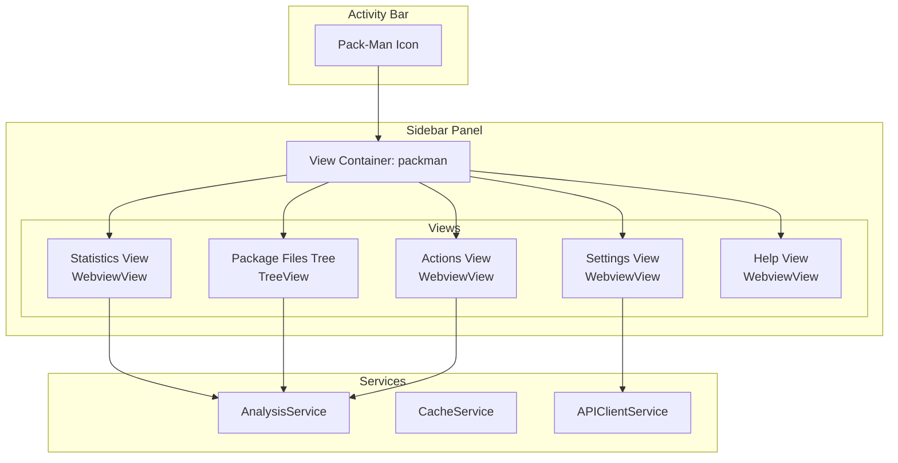

# Design Document: VS Code Activity Bar Icon and Panel

## Overview

This design document describes the implementation of a dedicated Activity Bar icon and sidebar panel for the Pack-Man VS Code extension. The feature provides a centralized hub for dependency analysis, settings configuration, and quick actions, improving discoverability and user experience.

The implementation leverages VS Code's native extension APIs including View Containers, Tree Views, and Webview Views to create a cohesive sidebar experience that integrates seamlessly with the VS Code interface.

## Architecture

The Activity Bar panel follows VS Code's standard extension architecture pattern:



### View Container Structure

The sidebar panel is organized into collapsible sections:

1. **Statistics View** (WebviewView) - Displays aggregated dependency health metrics
2. **Package Files View** (TreeView) - Hierarchical list of package files and their dependencies
3. **Actions View** (WebviewView) - Quick action buttons for common operations
4. **Settings View** (WebviewView) - Configuration options for API endpoint and auto-analyze
5. **Help View** (WebviewView) - Documentation links and version information

## Components and Interfaces

### Package.json Contributions

```typescript
// View Container contribution
interface ViewContainerContribution {
  id: 'packman';
  title: 'Pack-Man';
  icon: 'resources/packman-icon.svg';
}

// Views contribution
interface ViewsContribution {
  packman: [
    { id: 'packman.statistics', name: 'Overview', type: 'webview' },
    { id: 'packman.packageFiles', name: 'Package Files', type: 'tree' },
    { id: 'packman.actions', name: 'Actions', type: 'webview' },
    { id: 'packman.settings', name: 'Settings', type: 'webview' },
    { id: 'packman.help', name: 'Help', type: 'webview' }
  ];
}
```

### StatisticsViewProvider

```typescript
interface StatisticsViewProvider extends vscode.WebviewViewProvider {
  resolveWebviewView(webviewView: vscode.WebviewView): void;
  refresh(): void;
}

interface StatisticsData {
  total: number;
  upToDate: number;
  outdated: number;
  errors: number;
  lastUpdated: Date | null;
}
```

### PackageFilesTreeProvider

```typescript
interface PackageFilesTreeProvider extends vscode.TreeDataProvider<PackageTreeItem> {
  getTreeItem(element: PackageTreeItem): vscode.TreeItem;
  getChildren(element?: PackageTreeItem): PackageTreeItem[];
  refresh(): void;
}

interface PackageTreeItem {
  type: 'file' | 'package';
  uri?: vscode.Uri;
  name: string;
  status: 'healthy' | 'outdated' | 'error' | 'unknown';
  currentVersion?: string;
  latestVersion?: string;
  children?: PackageTreeItem[];
}
```

### ActionsViewProvider

```typescript
interface ActionsViewProvider extends vscode.WebviewViewProvider {
  resolveWebviewView(webviewView: vscode.WebviewView): void;
  setLoading(action: string, loading: boolean): void;
}

type ActionType = 'analyzeWorkspace' | 'refresh' | 'openSettings';
```

### SettingsViewProvider

```typescript
interface SettingsViewProvider extends vscode.WebviewViewProvider {
  resolveWebviewView(webviewView: vscode.WebviewView): void;
  refresh(): void;
}

interface SettingsData {
  apiEndpoint: string;
  autoAnalyzeOnSave: boolean;
  autoAnalyzeOnOpen: boolean;
  showCodeLens: boolean;
  showDiagnostics: boolean;
  hasGitHubToken: boolean;
}
```

### HelpViewProvider

```typescript
interface HelpViewProvider extends vscode.WebviewViewProvider {
  resolveWebviewView(webviewView: vscode.WebviewView): void;
}

interface HelpLink {
  label: string;
  url: string;
  icon: string;
}
```

## Data Models

### PackageTreeItem

```typescript
class PackageTreeItem extends vscode.TreeItem {
  constructor(
    public readonly type: 'file' | 'package',
    public readonly label: string,
    public readonly status: 'healthy' | 'outdated' | 'error' | 'unknown',
    public readonly collapsibleState: vscode.TreeItemCollapsibleState,
    public readonly uri?: vscode.Uri,
    public readonly currentVersion?: string,
    public readonly latestVersion?: string
  ) {
    super(label, collapsibleState);
    
    // Set icon based on status
    this.iconPath = this.getStatusIcon();
    
    // Set description (version info for packages)
    if (type === 'package' && currentVersion) {
      this.description = `${currentVersion} → ${latestVersion || '?'}`;
    }
    
    // Set command to open file
    if (type === 'file' && uri) {
      this.command = {
        command: 'vscode.open',
        title: 'Open File',
        arguments: [uri]
      };
    }
    
    // Set context value for context menu
    this.contextValue = `packman.${type}.${status}`;
  }
  
  private getStatusIcon(): vscode.ThemeIcon {
    switch (this.status) {
      case 'healthy': return new vscode.ThemeIcon('check', new vscode.ThemeColor('charts.green'));
      case 'outdated': return new vscode.ThemeIcon('warning', new vscode.ThemeColor('charts.yellow'));
      case 'error': return new vscode.ThemeIcon('error', new vscode.ThemeColor('charts.red'));
      default: return new vscode.ThemeIcon('question');
    }
  }
}
```

### View State Management

```typescript
interface SidebarState {
  isAnalyzing: boolean;
  lastAnalysisTime: Date | null;
  expandedFiles: Set<string>;
  statistics: StatisticsData;
}
```

## Correctness Properties

*A property is a characteristic or behavior that should hold true across all valid executions of a system-essentially, a formal statement about what the system should do. Properties serve as the bridge between human-readable specifications and machine-verifiable correctness guarantees.*

### Property 1: Statistics Aggregation Correctness

*For any* collection of analysis results from multiple package files, the aggregated statistics SHALL correctly sum the total, up-to-date, outdated, and error counts, where the sum of up-to-date, outdated, and error counts equals the total count.

**Validates: Requirements 2.1, 2.2, 2.3**

### Property 2: Tree Structure Generation Correctness

*For any* set of package files with analysis results, the tree data provider SHALL generate a tree structure where each file appears as a root node with correct name and status, and each file's dependencies appear as child nodes with correct name, current version, latest version, and status.

**Validates: Requirements 3.1, 3.2, 3.4**

### Property 3: URL Validation Correctness

*For any* string input to the API endpoint configuration, the validation function SHALL return true only for strings that represent valid HTTP or HTTPS URLs with proper protocol, host, and optional path components.

**Validates: Requirements 4.3**

## Error Handling

### Network Errors
- Display user-friendly error messages in the Statistics view when API calls fail
- Show retry button for transient failures
- Cache last successful results to display stale data with warning indicator

### Configuration Errors
- Validate API endpoint URL format before saving
- Show inline validation errors in Settings view
- Prevent saving invalid configurations

### File System Errors
- Handle missing or inaccessible package files gracefully
- Show "File not found" status for deleted files
- Auto-refresh tree when files are restored

### Token Errors
- Validate GitHub token format (basic pattern check)
- Show clear error when token is invalid or expired
- Provide link to GitHub token creation page

## Testing Strategy

### Dual Testing Approach

The implementation uses both unit tests and property-based tests:

- **Unit tests**: Verify specific examples, edge cases, and integration points
- **Property-based tests**: Verify universal properties that should hold across all inputs

### Property-Based Testing

The extension uses **fast-check** library for property-based testing (already configured in the project).

Each property-based test will:
- Run a minimum of 100 iterations
- Be tagged with a comment referencing the correctness property
- Use format: `**Feature: vscode-activity-bar, Property {number}: {property_text}**`

### Test Categories

1. **Statistics Aggregation Tests**
   - Property test: Aggregation correctness across random analysis results
   - Unit tests: Empty results, single file, multiple files with mixed statuses

2. **Tree Provider Tests**
   - Property test: Tree structure generation for random package files
   - Unit tests: Empty workspace, nested dependencies, file status icons

3. **URL Validation Tests**
   - Property test: URL validation for random string inputs
   - Unit tests: Valid URLs, invalid URLs, edge cases (empty, whitespace, malformed)

4. **View Provider Tests**
   - Unit tests: HTML generation, message handling, state updates
   - Integration tests: View registration, event subscriptions

### Test File Organization

```
vscode-extension/src/
├── views/
│   ├── statisticsViewProvider.ts
│   ├── statisticsViewProvider.test.ts
│   ├── packageFilesTreeProvider.ts
│   ├── packageFilesTreeProvider.test.ts
│   ├── actionsViewProvider.ts
│   ├── actionsViewProvider.test.ts
│   ├── settingsViewProvider.ts
│   ├── settingsViewProvider.test.ts
│   ├── helpViewProvider.ts
│   └── helpViewProvider.test.ts
└── utils/
    ├── urlValidator.ts
    └── urlValidator.test.ts
```

